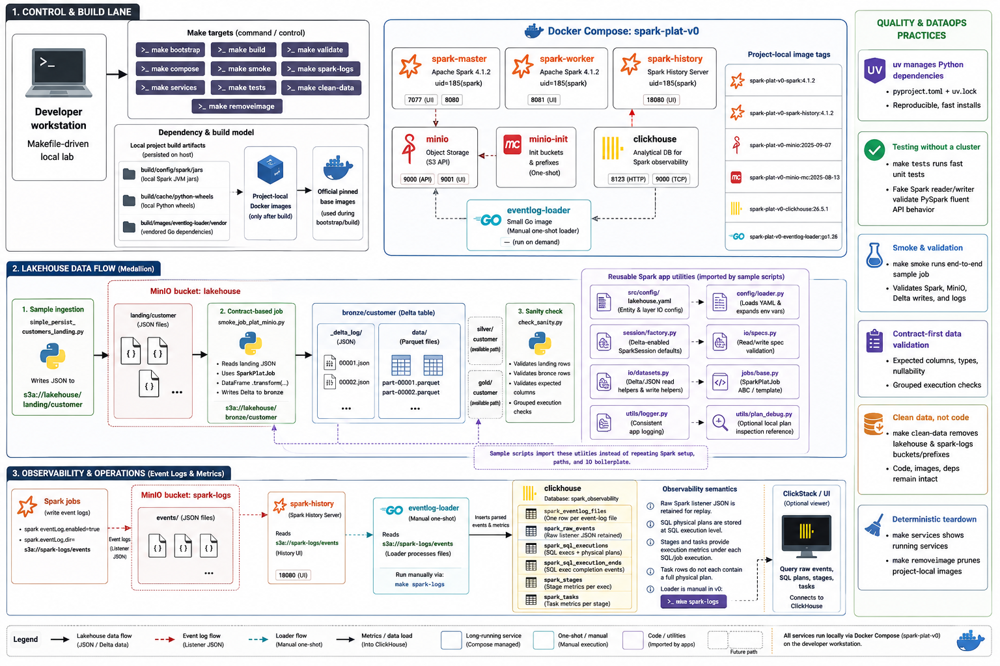

# Spark Platform v0



Local Spark platform for validating Spark 4.1.2, Delta Lake 4.2.0, MinIO-backed lakehouse data, Spark event logs, Spark History, and ClickHouse-based execution observability.

## Quick Start

Before setup, check [docs/machine-requirements.md](docs/machine-requirements.md) for required host tools, validated versions, and install notes.

```bash
make bootstrap
make build
make validate
make tests
make compose
make smoke
make spark-logs
make services
```

Use `make down` to stop the stack without deleting local data. Use `make clean-data` to delete local MinIO and ClickHouse state. Use `make removeimage` to remove only the local project images while preserving downloaded jars, Python wheels, and vendored Go dependencies.

## Service Roles

- Spark writes landing JSON and Delta data to MinIO bucket `lakehouse`, using medallion prefixes `landing/`, `bronze/`, `silver/`, and `gold/`.
- Spark writes event logs to MinIO bucket `spark-logs`, prefix `events/`.
- Spark History reads the same MinIO event-log prefix.
- `eventlog-loader` is a small Go image that runs on demand and loads event logs into ClickHouse.
- ClickHouse stores raw Spark events plus normalized SQL, stage, and task tables.

## Build Model

`make bootstrap` downloads external dependencies once into local project folders. `make bootstrap` also validates `uv` and runs `uv sync` for the Python test environment. `make build` then builds every image used by Compose from those local dependencies:

- `spark-plat-v0-spark:4.1.2`
- `spark-plat-v0-spark-history:4.1.2`
- `spark-plat-v0-minio:2025-09-07`
- `spark-plat-v0-minio-mc:2025-08-13`
- `spark-plat-v0-clickhouse:26.5.1`
- `spark-plat-v0-eventlog-loader:go1.26`

Spark runtime and Spark History run as the upstream Spark user, `uid=185(spark)`, after root-only image build steps complete.

## Documentation

- `docs/dev-design/architecture.md`: architecture decisions and component responsibilities.
- `docs/dev-design/operations.md`: operational commands, cleanup behavior, credentials, and service access.
- `docs/dev-design/design-pattern-v0-disccusion.md`: agentic Spark optimization guardrail rationale and design discussion.
- `docs/machine-requirements.md`: required host tools, validated versions, and install notes.
- `docs/dev-design/compatibility.md`: version compatibility notes.
- `docs/next-steps.md`: current roadmap and low-hanging improvements.
- `docs/logs-info/README.md`: Spark event-log and ClickHouse observability guide.
- `agent_readme.md`: handoff context for agents continuing the project.

## Spark App Utilities

Sample jobs use reusable Python utilities under `src/spark_platform`:

- `config/loader.py`: loads `src/config/lakehouse.yaml` and resolves entity/layer read-write settings.
- `session/factory.py`: creates a default Delta-enabled Spark session that scripts can extend with extra Spark config.
- `io/specs.py`: validates read/write specs before IO execution.
- `io/datasets.py`: public read/write helpers for Delta and JSON reads plus Delta and JSON writes.
- `jobs/base.py`: ABC/template contract for app scripts.
- `utils/logger.py`: project logger adapted from the formation repository pattern.
- `utils/plan_debug.py`: commented optional reference for direct DataFrame physical-plan inspection during local development.

The current example entity is `customer`. `make smoke` persists sample JSON to `s3a://lakehouse/landing/customer`, runs the contract-based bronze job to `s3a://lakehouse/bronze/customer`, then runs a sanity check over both layers. Spark app names are owned by runner scripts, with `SparkSessionFactory.DEFAULT_APP_NAME` used only as a fallback.

Sample scripts live under `src/apps/sample_scripts`:

- `simple_persist_customers_landing.py`: simple ingestion-style script that writes fake customer JSON to landing.
- `smoke_job_plat_minio.py`: `SparkPlatJob` implementation that reads landing JSON and writes bronze Delta.
- `check_sanity.py`: explicit validation script for landing and bronze outputs.
- `README.md`: guide for the segmented sample flow and script contract.

## Python Tests

Python tests are managed with `uv` from the project root. The fast IO tests use fake Spark objects, so they validate the Spark fluent API calls without a running Spark cluster and without importing PySpark.

```bash
make tests
# or
make test
```
